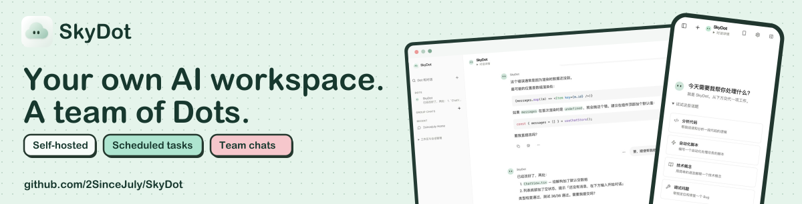

# 2SinceJuly

#### Student building AI agents · Creator of SkyDot · Contributor to REA, Qwen Code, …

  

## 🚀 New

  

- ☁️ **[SkyDot](https://github.com/2SinceJuly/SkyDot)** is a self-hosted AI assistant for individuals and small teams. Give a Dot a workspace, schedule a weekly report, or ask several Dots to work together.
- Try the [desktop demo](https://skydot.eu.cc/) or [mobile demo](https://skydot.eu.cc/mobile), or [run it yourself](https://github.com/2SinceJuly/SkyDot#自己部署).

### 🔥 Open Source Contributions

<!-- CONTRIBUTIONS:START -->
<table>
<thead><tr><th>Project</th><th>Stars</th><th>Org</th><th>Merged</th><th>Focus</th></tr></thead>
<tbody>
<tr><td><strong><a href="https://github.com/morluto/rea">REA</a></strong></td><td></td><td>morluto</td><td></td><td>Mach-O/IPS analysis, process sandbox, SQLite paging</td></tr>
<tr><td><strong><a href="https://github.com/QwenLM/qwen-code">Qwen Code</a></strong></td><td></td><td>QwenLM</td><td></td><td>MCP tool routing, telemetry, shell context</td></tr>
<tr><td><strong><a href="https://github.com/Tencent/AI-Infra-Guard">AI-Infra-Guard</a></strong></td><td></td><td>Tencent</td><td></td><td>NVD advisories for AI products</td></tr>
<tr><td><strong><a href="https://github.com/stablyai/orca">Orca</a></strong></td><td></td><td>stablyai</td><td></td><td>Droid hooks, Claude plan labels, usage reporting</td></tr>
<tr><td><strong><a href="https://github.com/agentscope-ai/OpenJudge">OpenJudge</a></strong></td><td></td><td>agentscope-ai</td><td></td><td>Evaluation prompts, grader validation</td></tr>
<tr><td><strong><a href="https://github.com/bytedance/deer-flow">DeerFlow</a></strong></td><td></td><td>ByteDance</td><td></td><td>Thread lifecycle, agent memory, message parsing</td></tr>
<tr><td><strong><a href="https://github.com/agentscope-ai/agentscope">agentscope</a></strong></td><td></td><td>agentscope-ai</td><td></td><td>RAG upload routing, multi-tenant context</td></tr>
<tr><td><strong><a href="https://github.com/Yuan1z0825/nature-skills">Nature Skills</a></strong></td><td></td><td>Yuan1z0825</td><td></td><td>Editable text in PDF figures</td></tr>
<tr><td><strong><a href="https://github.com/pingdotgg/t3code">T3 Code</a></strong></td><td></td><td>pingdotgg</td><td></td><td>Work-log image layout</td></tr>
</tbody>
</table>

<strong>Highlights</strong>

<strong>morluto · REA</strong>

<ul>
<li><a href="https://github.com/morluto/rea/pull/9570">Join IPS images to admitted Mach-O slices</a></li>
<li><a href="https://github.com/morluto/rea/pull/8469">Add a non-executing dry run to capture_process_scenario</a></li>
<li><a href="https://github.com/morluto/rea/pull/9331">Page selected rows with a stated order and row offset</a></li>
<li><a href="https://github.com/morluto/rea/pull/9108">Probe providers with the selected client&#x27;s registration environment</a></li>
</ul>

<strong>QwenLM · Qwen Code</strong>

<ul>
<li><a href="https://github.com/QwenLM/qwen-code/pull/15757">Keep uniquely named MCP tools when names collide</a></li>
<li><a href="https://github.com/QwenLM/qwen-code/pull/16495">Record OpenRouter routing backend and generation id</a></li>
<li><a href="https://github.com/QwenLM/qwen-code/pull/16491">Name the active shell in the startup context</a></li>
</ul>

<strong>Tencent · AI-Infra-Guard</strong>

<ul>
<li><a href="https://github.com/Tencent/AI-Infra-Guard/pull/742">Add 35 AI product CVE advisories from NVD</a></li>
</ul>

<strong>stablyai · Orca</strong>

<ul>
<li><a href="https://github.com/stablyai/orca/pull/47853">Install managed hooks where Droid reads them</a></li>
<li><a href="https://github.com/stablyai/orca/pull/47836">Keep a Task worker&#x27;s hooks off the pane&#x27;s agent row</a></li>
<li><a href="https://github.com/stablyai/orca/pull/47804">Show renamed Claude plans Max 5x and Max 20x as Max and Ultra</a></li>
</ul>

<strong>agentscope-ai · OpenJudge</strong>

<ul>
<li><a href="https://github.com/agentscope-ai/OpenJudge/pull/224">Send the evaluation prompt instead of the JSON system prompt</a></li>
<li><a href="https://github.com/agentscope-ai/OpenJudge/pull/226">Reject non-finite numbers in JsonValidatorGrader</a></li>
<li><a href="https://github.com/agentscope-ai/OpenJudge/pull/218">Stop JsonMatchGrader matching a missing key against null</a></li>
</ul>

<strong>ByteDance · DeerFlow</strong>

<ul>
<li><a href="https://github.com/bytedance/deer-flow/pull/8036">Evict in-memory runs when a thread is deleted</a></li>
<li><a href="https://github.com/bytedance/deer-flow/pull/8146">Scope memory management to the named agent&#x27;s bucket</a></li>
<li><a href="https://github.com/bytedance/deer-flow/pull/8066">Drop empty typed text blocks from user content</a></li>
</ul>

<strong>agentscope-ai · agentscope</strong>

<ul>
<li><a href="https://github.com/agentscope-ai/agentscope/pull/3986">Route generic uploads by filename when no parser matches</a></li>
<li><a href="https://github.com/agentscope-ai/agentscope/pull/3976">Keep other knowledge bases&#x27; context when one fails</a></li>
</ul>

<strong>Yuan1z0825 · Nature Skills</strong>

<ul>
<li><a href="https://github.com/Yuan1z0825/nature-skills/pull/284">Accept ggsave(device = cairo_pdf) in editable-text check</a></li>
</ul>

<strong>pingdotgg · T3 Code</strong>

<ul>
<li><a href="https://github.com/pingdotgg/t3code/pull/41597">An unavailable work-log image keeps the 10rem strip instead of filling the row</a></li>
</ul>

<!-- CONTRIBUTIONS:END -->
